# Tamil Heritage — Redesign

A modern, bilingual **(English ⇄ தமிழ்)** redesign concept for **[telibrary.com](https://telibrary.com/en/)** — the Tamil diaspora's non‑political digital archive of history, language, culture and identity, founded in memory of the **Jaffna Public Library** (burned on 31 May 1981, destroying 97,000+ books and irreplaceable palm‑leaf manuscripts).

The goal: replace the dated news‑portal theme with a dignified **“digital archive / editorial museum”** experience that matches the weight of the material — while staying easy to rebuild as a WordPress theme.

**Live demo:** [tamil-heritage.vercel.app](https://tamil-heritage.vercel.app) · [GitHub Pages](https://parthee-vijaya.github.io/tamil-heritage-redesign/)

---

## Before → After

| Current site (telibrary.com) | Redesign |
| --- | --- |
| 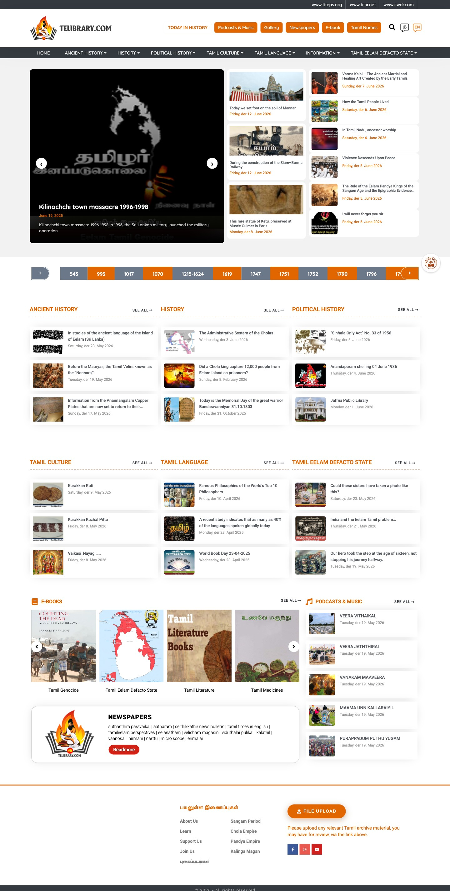 | 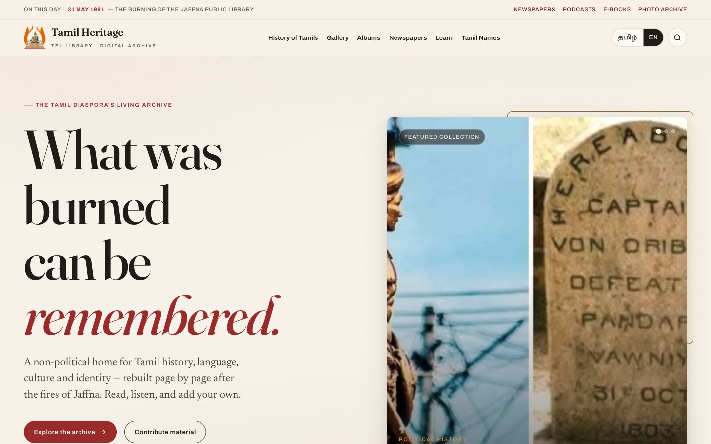 |

---

## Screens

### Home
A calm, editorial front page: a **rotating featured story**, a scroll‑animated **1981 memorial band** (the 97,000+ counts up as you reach it), a chronology of Tamil history, curated bento collections, media shelves and a contribute call‑to‑action.


### Fully bilingual — one click switches everything
The **தமிழ் / EN** toggle swaps the entire site (nav, headings, body, labels, even the page `<title>`, search placeholder and the date‑driven modules) and remembers your choice. Tamil is set in **Tiro Tamil** (display/body) + **Catamaran** (UI) so it reads as polished as the English.

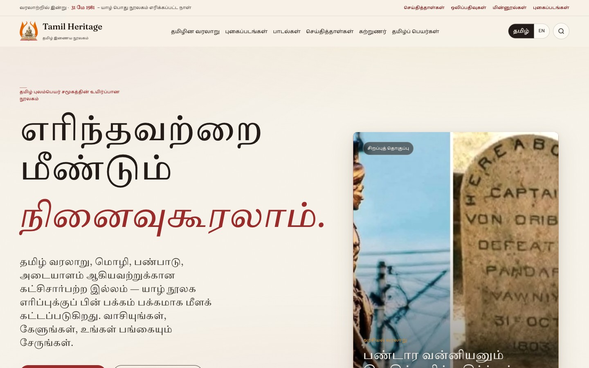

### Today in history
A **date‑aware** band that surfaces a real dated event from Tamil / Eelam history — browsable and fully bilingual.

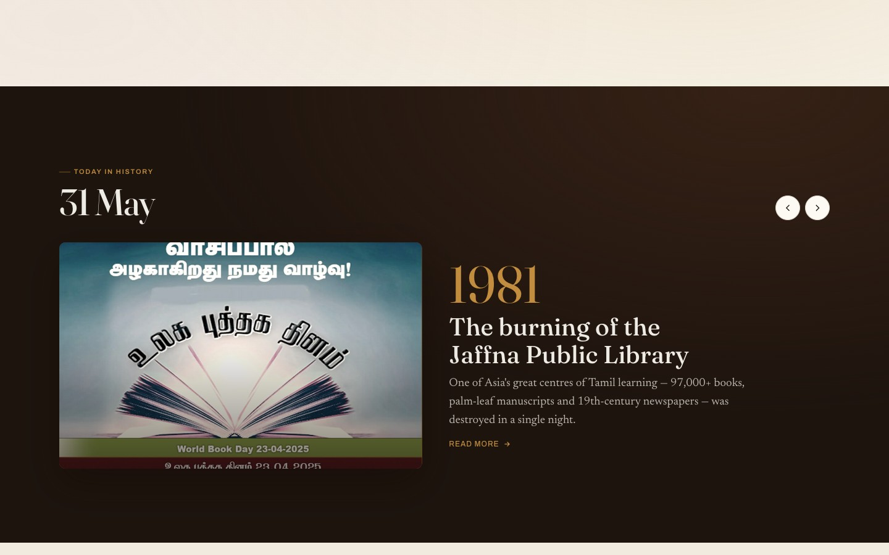

### Article
Museum‑quality long‑form layout — drop‑cap, comfortable reading measure, pull‑quotes, a **catalogue / provenance** sidebar, sources, and related entries.

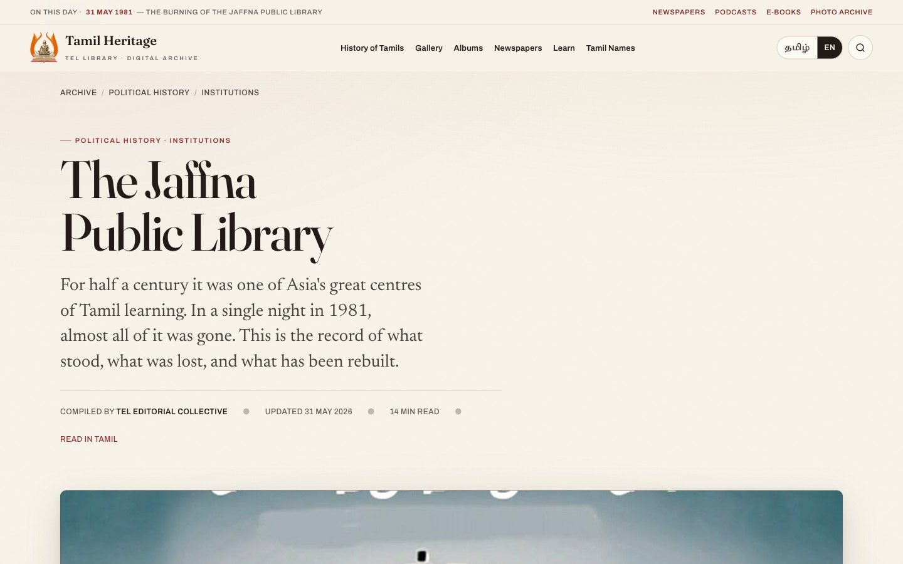

### Archive / browse
Real browse experience with **filters** (era, type, language), chronological sorting, semantic type badges and pagination.

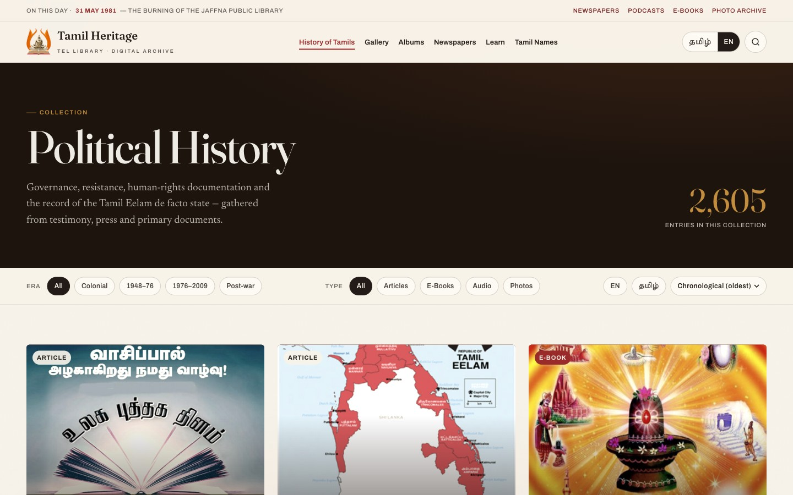

### Gallery
Masonry photo grid with an accessible **lightbox** (keyboard nav, focus trap, focus return).

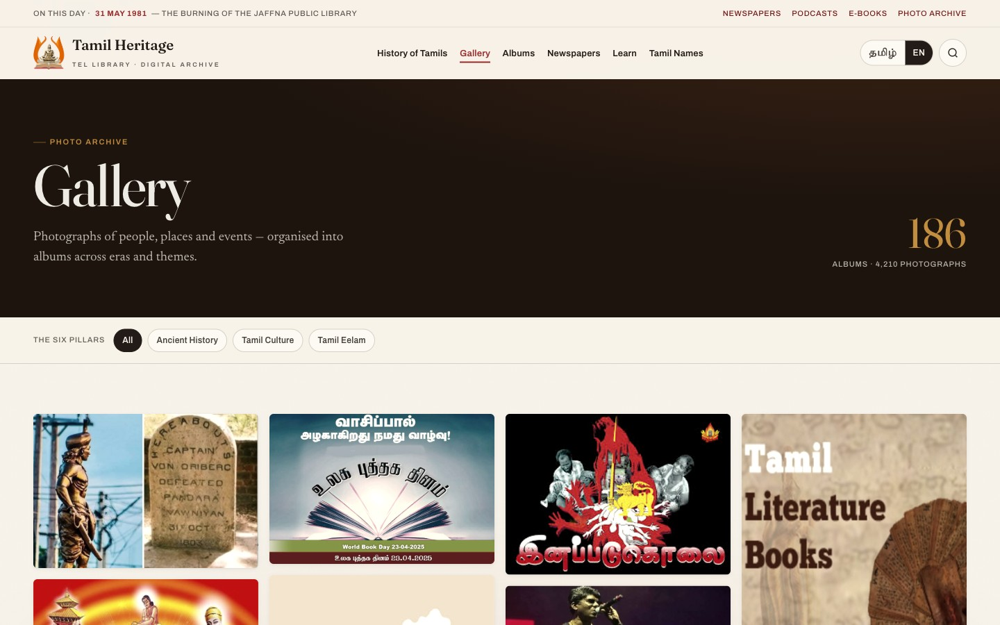

### Tamil names database
Instant **search**, gender filters and a Tamil alphabet strip over a grid of names with bilingual meanings.

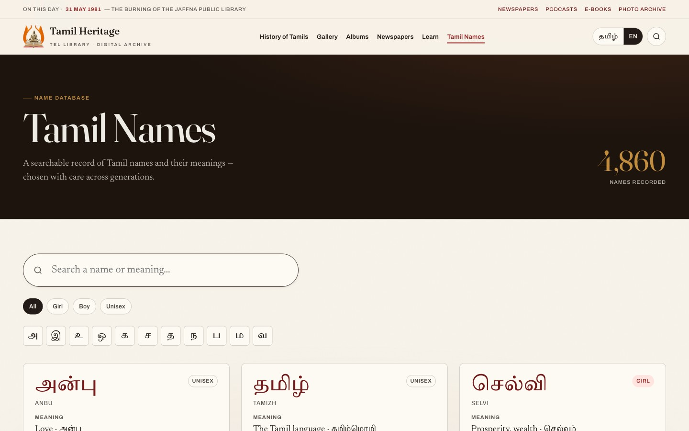

### Albums & Newspapers
The media library — song / recording **albums** with a sticky player bar, and a **newspaper archive** (press scans filtered by title and decade).

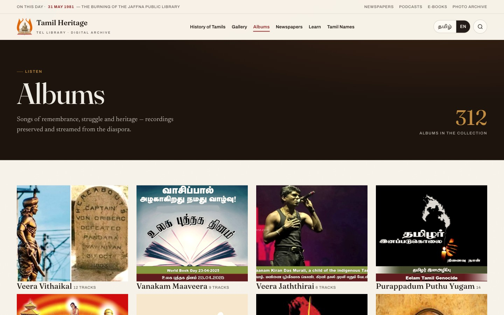
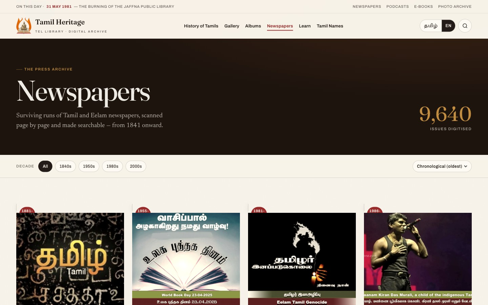

### Learn
Guided **learning paths** through the Tamil script, classical literature and history — levelled, with progress.

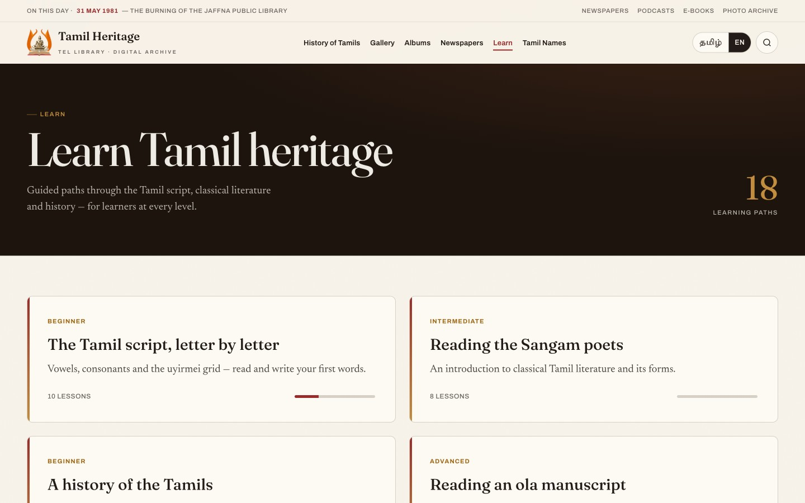

### About
The origin story — the 1981 fire, the non‑political mission, and how the diaspora rebuilds the archive, page by page.

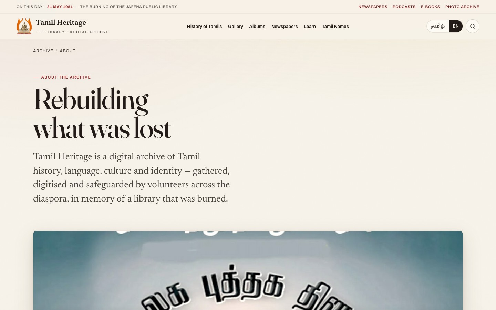

### Responsive
Designed mobile‑first; no horizontal overflow from 320 → 1440px.

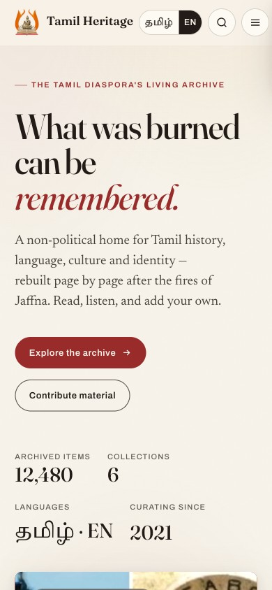

---

## Features

- **9 pages** — Home, About, Article, Archive, Gallery, Albums, Newspapers, Learn, Tamil Names.
- **English ⇄ Tamil** toggle with authentic strings (nav, sections and article titles taken from telibrary.com), persisted in `localStorage`, with full Tamil typography — re‑renders the date‑driven modules too.
- **Editorial design system** — warm parchment palette in `oklch`, memorial maroon + heritage ochre accents, a real type pairing, film‑grain atmosphere, and a signature chronology timeline.
- **Storytelling moments** — a rotating featured‑story hero, a scroll‑triggered count‑up on the 1981 band, and a date‑aware "Today in history" module.
- **Accessible** — semantic landmarks, keyboard‑operable nav/lightbox with focus management, `lang="ta"` on Tamil text, visible focus rings (adapted on dark bands), WCAG‑AA‑minded contrast, and `prefers-reduced-motion` honoured throughout.
- **Interactive** — horizontal rails, gallery lightbox, live names search, album player bar.
- **Fast & self‑contained** — static HTML/CSS/vanilla JS, no build step, no framework.

## Design system

| Role | English | Tamil |
| --- | --- | --- |
| Display | Fraunces | Tiro Tamil |
| Body | Newsreader | Tiro Tamil |
| UI / labels | Archivo | Catamaran |

Palette: warm parchment surfaces, deep ink text, **memorial maroon** (`oklch(46% 0.145 25)`) and **heritage ochre** (`oklch(68% 0.115 74)`) used semantically. All tokens live in [`styles/tokens.css`](styles/tokens.css).

## Project structure

```
.
├── index.html · about.html · article.html · archive.html
├── gallery.html · albums.html · newspapers.html · learn.html · names.html
├── styles/        # tokens, typography, global, per-feature CSS, i18n (Tamil mode)
├── scripts/       # nav, rail, reveal, filters, pages, i18n (bilingual engine)
└── screenshots/   # images used in this README
```

## Roadmap

- [`REFINEMENT-PLAN.md`](REFINEMENT-PLAN.md) — deeper design refinement + more sections ported from the original. **Phase 1 shipped** (About page · "Today in History" module · 1981 scroll count‑up · rotating hero). Still ahead: Notable Figures directory, the Tamil Eelam de-facto-state archive, global search, media detail pages.
- [`SUBPAGES-PLAN.md`](SUBPAGES-PLAN.md) — the original build plan for the five subpages (now built).

## Run locally

It's a static site — open `index.html` directly, or serve the folder:

```bash
python3 -m http.server 8000
# then visit http://localhost:8000
```

## Path to a WordPress theme

The prototype maps 1:1 onto a custom WordPress theme so telibrary.com keeps WordPress (and all its content + editing):

- `index.html` → `front-page.php`, `article.html` → `single.php`, `archive.html` → `archive.php`
- the CSS/JS are enqueued in `functions.php`
- the EN/Tamil toggle maps to the existing `qtranslate-x` plugin

## Credits

A redesign concept. Content, imagery and the **Thiruvalluvar emblem** belong to **[Tamil Heritage / TEL Library](https://telibrary.com/en/)**. Built in memory of the Jaffna Public Library.
